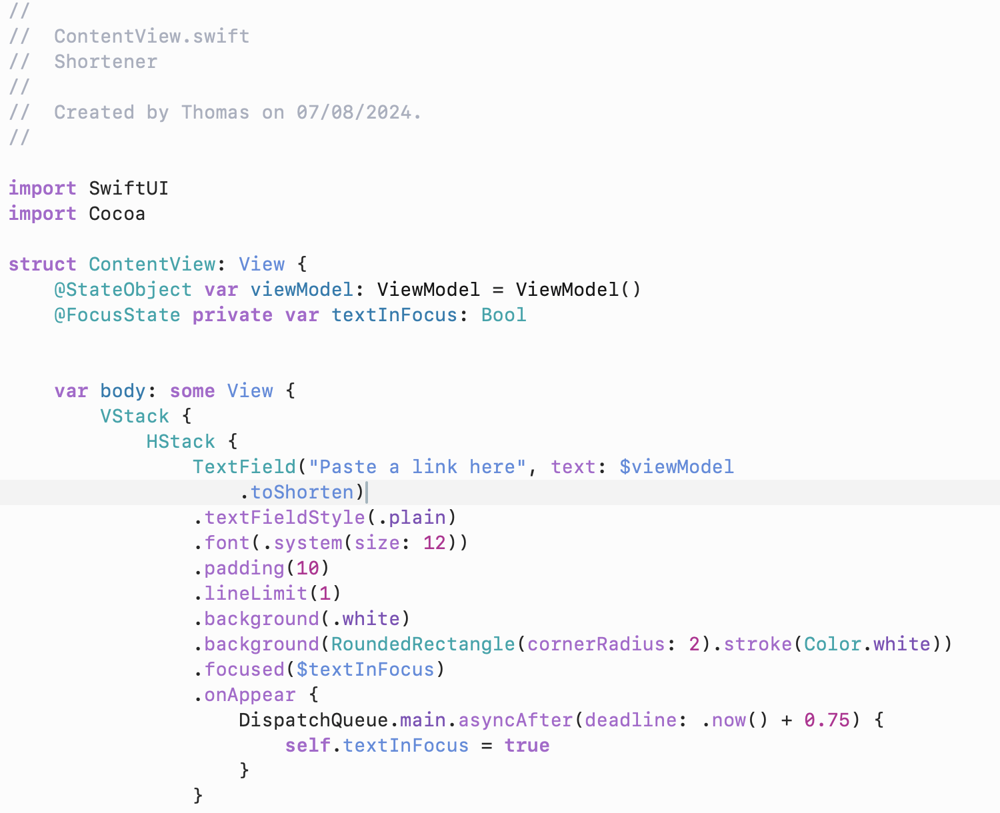

# Night Owl Light for Xcode

A port of Sarah Drasner's [Night Owl Light](https://github.com/sdras/night-owl-vscode-theme/) to Xcode. Made using Xcode's built-in theme editor.

## Preview

## Installation

1. Download the `Night Owl Light.xccolortheme` file
2. Move the file into `~/Library/Developer/Xcode/UserData/FontAndColorThemes/`.
3. Open Xcode's preferences using `⌘ command + ,`.
4. Navigate to "Themes" in the preferences window, and select "Night Owl Light".
	- If the theme does not appear, restart Xcode
